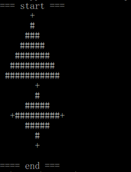

# ASCII-shapes-of-stars-and-trees
As a geeky Christmas fan I want to generate ASCII shapes of stars and trees in three different sizes so that I can decorate my office nicely for Christmas.



The following sizes will be available:
 - S (small): 5 lines height
 - M (medium): 7 lines height
 - L (large): 11 lines height


### Installation

requires PHP7 to run.
just clone the repositoy and run the index.php file. 

```sh
$ cd C:\xampp\htdocs\ASCII-shapes-of-stars-and-trees>
$ php index.php
```
